# Batch Pipeline 데이터 처리(고급) 예제

## 날짜와 타임스탬프

### convertDate
   - 타임스탬프의 포맷을 다른 포맷으로 변경한다.

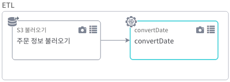

1. 기본 제공 기능

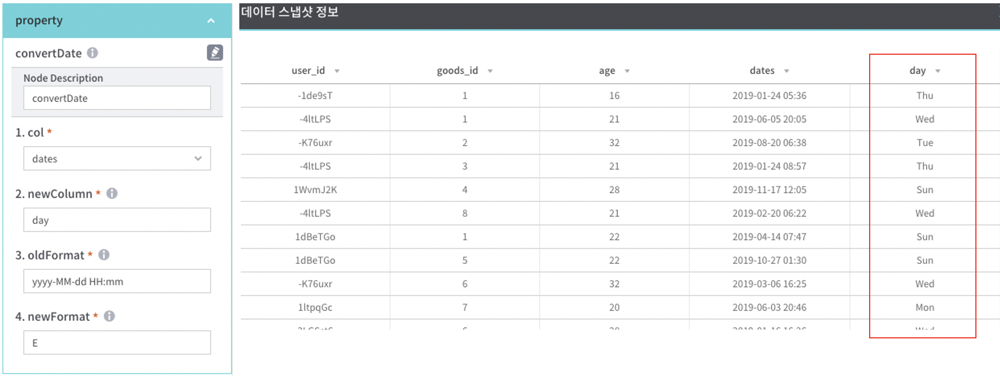

| 항목 | 설명 |
|---|---|
| col | 목록 중 기준 컬럼 선택 |
| newColumn | 신규 컬럼 명 |
| oldFormat | "col" 컬럼의 날짜 포맷 |
| newFormat | 신규 날짜 포맷 |

### timeMove
   - 타임스탬프 컬럼의 시간을 설정된 값만큼 이동

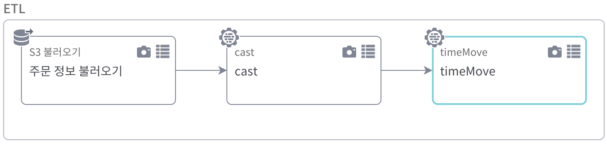

1. 기본 제공 기능

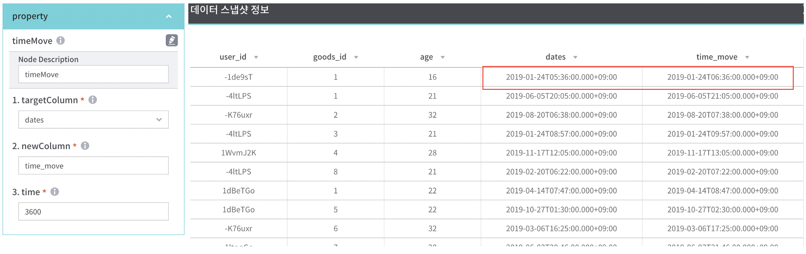

| 항목 | 설명 |
|---|---|
| targetColumn | 목록 중 기준 컬럼 선택 ( 선택한 컬럼은 타임스탬프 데이터 타입이여야 함 ) |
| newColumn | 신규 컬럼 명 |
| time | 이동할 시간 (ex. 3600(1시간 후), -3600(1시간 전) |

### addTimestamp
   - 타임스탬프 컬럼 추가
   
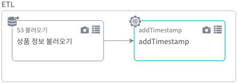

1. 기본 제공 기능

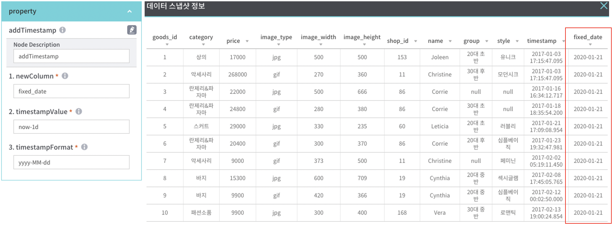

| 항목 | 설명 |
|---|---|
| newColumn | 신규 컬럼 명 |
| timestampValue | 추가할 날짜값 (ex. now-1d , now-1h) |
| timestampFormat | 날짜 형식 (ex. yyyyMMddHHmmss) |

### removeTa
   - 정해진 기간만큼의 데이터 행을 삭제

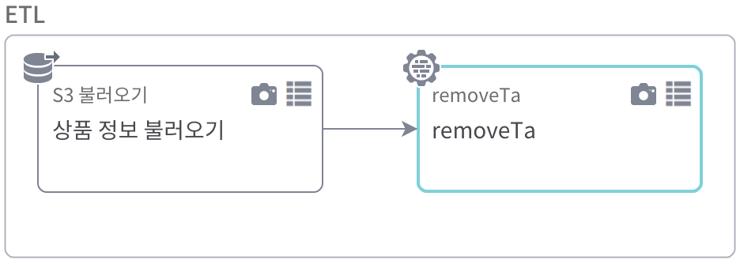

1. 기본 제공 기능

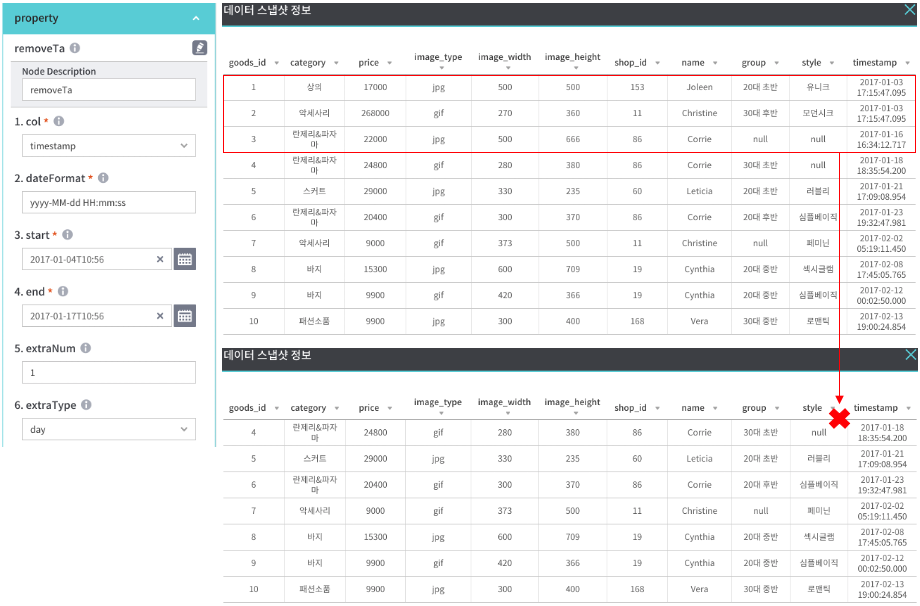

| 항목 | 설명 |
|---|---|
| col | 목록 중 날짜 기준 컬럼 선택 |
| dateFormat | 날짜 포맷을 지정 |
| start | 시작 날짜를 선택 |
| end | 종료 날짜를 선택 |
| extraNum | 날짜 범위 전후로 추가로 확인할 값 |
| extraType | 날짜 범위 전후로 추가로 확인할 값의 단위, *extraType 코드 참조 |

| *extraType 코드 |
|---|
| second |
| minute |
| hour |
| day |

### removeTaAuto
   - 기간 단위 기준으로 결측치 비율에 따른 데이터 행을 삭제

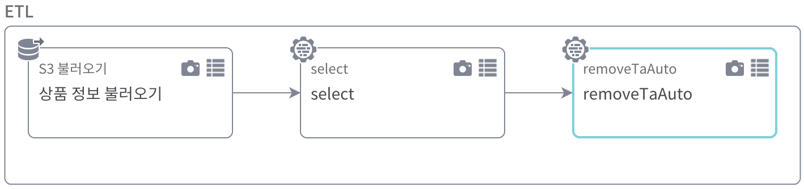

1. 기본 제공 기능

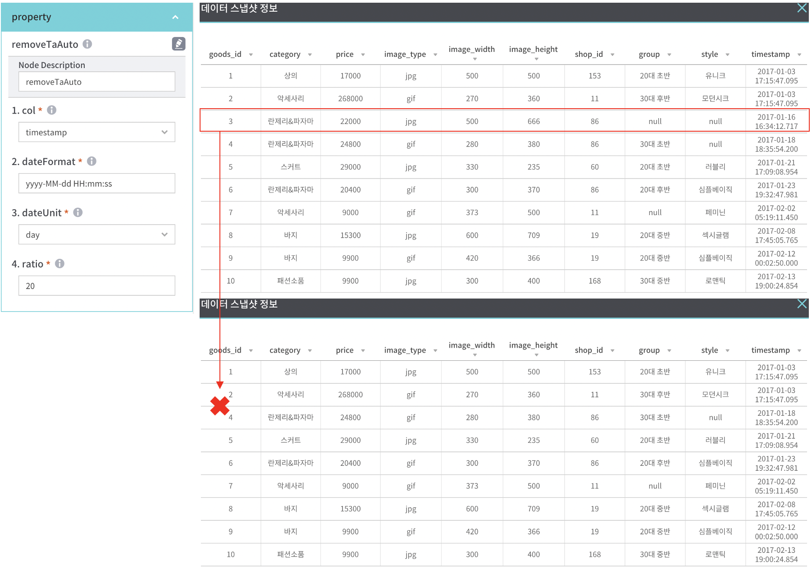

| 항목 | 설명 |
|---|---|
| col | 목록 중 기준 날짜 컬럼 선택 |
| dateFormat | 선택한 "col"의 날짜 포맷을 지정 |
| dateUnit | 결측치 비율을 확인할 기간 단위 기준(hour, day 중 택1) |
| ratio | 결측치 비율 |

## 사용자 정의

### SQL
   - SQL query을 사용하여 사용자 정의 코드 입력

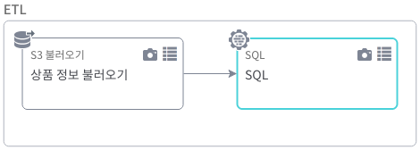

1. 기본 제공 기능

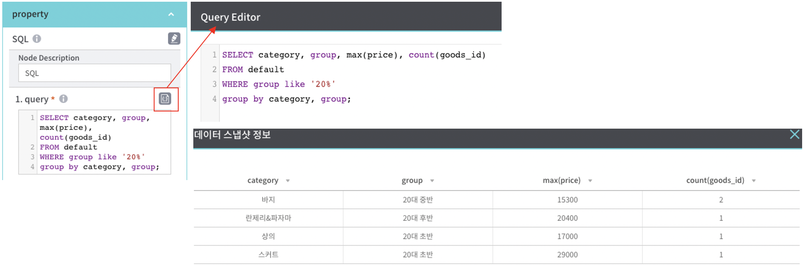

| 항목 | 설명 |
|---|---|
| query | 데이터 처리를 위한 SQL Select 문 입력 (테이블 명은 'default'만 가능) |
| overwriteSchema | 실행 결과에 대한 데이터 스키마 저장 여부 |

### customCode
   - PySpark의 DataFrame 함수를 사용하여 사용자 정의 코드 입력

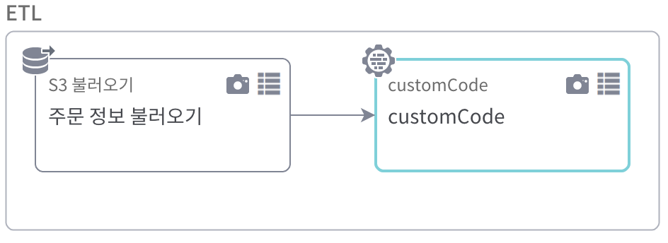

1. 기본 제공 기능

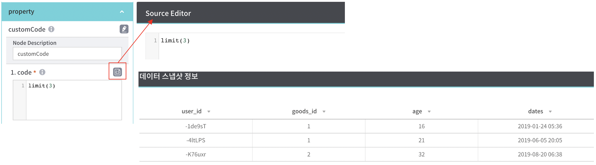

| 항목 | 설명 |
|---|---|
| code | PySpark의 DataFrame 함수 1줄 입력 |
| overwriteSchema | 실행 결과에 대한 데이터 스키마 저장 여부 |

## 치환

### codeToMatrix
   - 컬럼을 지정하여 해당 컬럼의 모든 코드값을 신규 컬럼으로 추가
   - 신규 컬럼과 매핑되는 컬럼의 값은 1, 매핑되지 않으면 0으로 생성

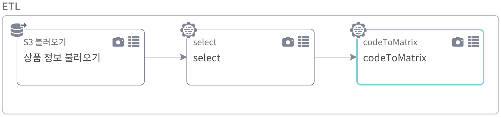

1. 기본 제공 기능

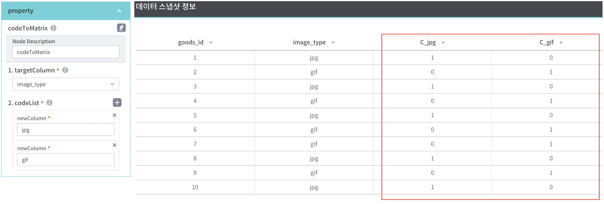

| 항목 | 설명 |
|---|---|
| targetColumn | 목록 중 기준 컬럼 선택 |
| codeList | 코드 목록 정의 |

### addConditionCol
   - 입력한 조건식 결과, True/False 에 대해서 정의한 값을 매핑

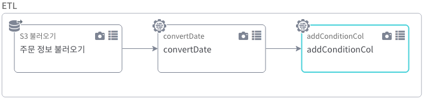

1. 기본 제공 기능

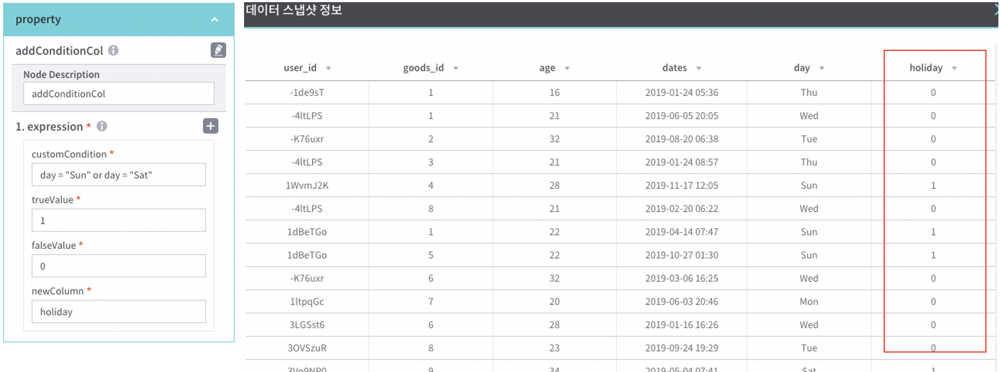

| 항목 | 설명 |
|---|---|
| customCondition | 조건식 입력 |
| trueValue | 조건식 결과 True일 경우 매핑 될 값 |
| falseValue | 조건식 결과 False일 경우 매핑 될 값 |
| newColumn | 신규 컬럼 명 |

### regexp
   - 선택한 컬럼의 문자열에서 정규표현식에 기반하여 매칭되는 문자를 추출

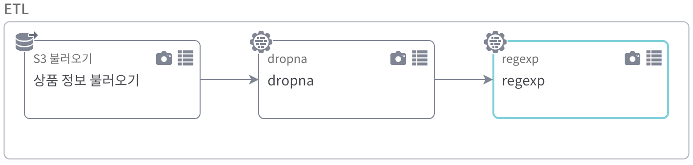

1. 기본 제공 기능

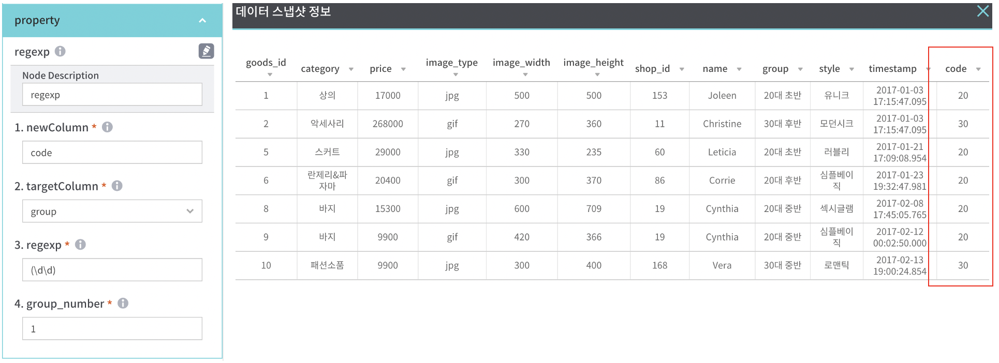

| 항목 | 설명 |
|---|---|
| newColumn | 신규 컬럼 명 |
| targetColumn | 목록 중 기준 컬럼 선택 |
| regexp | 정규표현식 |
| group_number | 사용할 표현식의 순서를 입력 |

## 삭제

### dropNaCol
   - 전체 또는 정해진 비율만큼이 결측값으로 된 컬럼을 제거

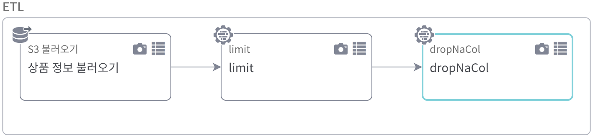

1. 기본 제공 기능

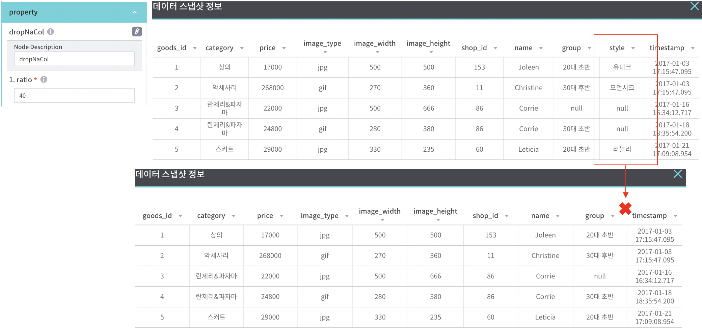

| 항목 | 설명 |
|---|---|
| ratio | 결측값의 분포 비율 |
| col | 지정된 컬럼을 Grouping하여 해당 그룹이 조건에 해당하면 컬럼을 모두 제거 |

### dropConstCol
   - 전체 또는 정해진 비율만큼이 동일한 값으로 된 컬럼을 모두 제거한다.

### dropSaturateCol
   - Min/Max값이 정해진 비율만큼 치우쳐져 있을때 해당 컬럼을 모두 제거한다.

### nearZeroVar
   - 분산이 0에 가까운 컬럼을 모두 제거한다. (R에서 제공하는 함수와 동일한 기능)
   - 프로퍼티(freqCnt, uniqueCnt)에 0에 가까운 기준을 설정한다.

## ML

### mlPipeline
   - ML 모델을 불러와서 예측 결과를 출력한다.

