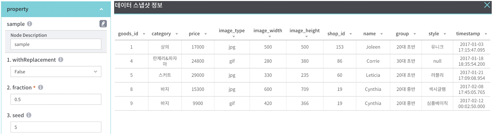
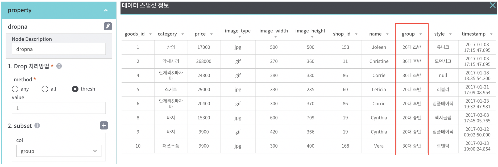
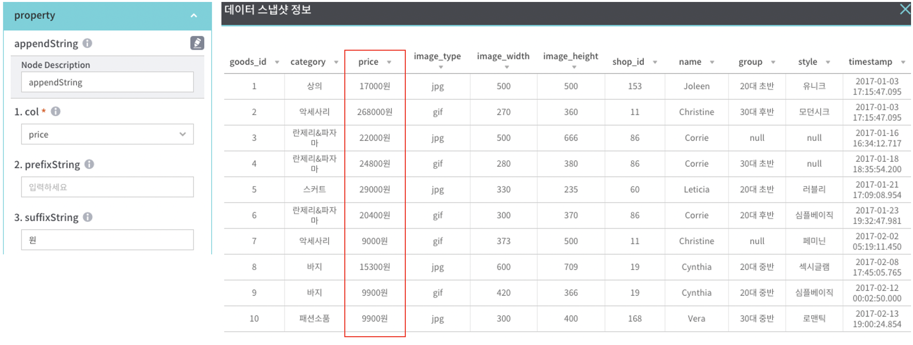
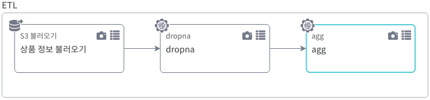

# Batch Pipeline 데이터 처리(기본) 예제

## 사용 데이터

- **상품 정보**: 상품의 정보와 상품을 판매하는 쇼핑몰 정보.
- **사용자 주문 정보**: 상품을 주문한 사용자 정보.

### 상품 정보

상품의 정보와 상품을 판매하는 쇼핑몰 정보가 담겨 있다.

| goods_id | category | price | image_type | image_width | image_height | shop_id | name | group | style | timestamp |
|---|---|---|---|---|---|---|---|---|---|---|
| 상품 교유 식별자 | 상품 카테고리 | 상품 가격 | 상품 이미지 확장자 | 상품 이미지 너비 | 상품 이미지 높이 | 쇼핑몰 고유 식별자 | 쇼핑몰 이름 | 쇼핑몰이 등록한 연령대 | 쇼핑몰이 등록한 스타일 | 상품 정보 등록 시간 |

- 상품 샘플 데이터

- 상품 추가 샘플 데이터

### 사용자 주문 정보

상품을 주문한 사용자 정보

| user_id | goods_id | age | date |
|---|---|---|---|
| 사용자 고유 식별자 | 주문한 상품의 고유 식별자 | 사용자 나이 | 주문 날짜 |

- 사용자 주문 샘플 데이터

---

## 조건 검색

### filter
   - 데이터를 컬럼(n개) 단위로 조건을 설정하여 필터링
   

1. 기본 제공 기능

| 항목 | 설명 |
|---|---|
| col | 목록 중 필터 적용할 컬럼 선택 |
| filterOption | *filterOption 코드 참조 |
| filterValue | 필터 기준값 입력 (문자열일 경우 ""으로 표현) |
| filterOperator | 필터 사이의 조건 연산자 (AND, OR) |

| *filterOption 코드 |
|---|
| less than(<) |
| less than or equal(<=) |
| equal(=) |
| not equal(!=) |
| greater than or equal(>=) |
| greater than(>) |
| contains |
| not contains |
| like | 

2. 사용자 입력 기능

| 항목 | 설명 |
|---|---|
| useCustom | 사용자 입력 기능 사용 시 체크 |
| customCondition | 사용자가 원하는 조건식을 직접 입력 |

### sort

   - 데이터를 컬럼(n개) 단위로 정렬 기준을 적용
   - property 에 설정한 컬럼 순서에 따라 정렬 우선순위 적용
   

1. 기본 제공 기능

| 항목 | 설명 |
|---|---|
| 대상 컬럼 | 목록 중 정렬 적용할 컬럼 선택 |
| 정렬 기준 | asc(오름차순), desc(내림차순) |

### topN
   - 데이터를 컬럼(1개) 기준으로 정렬하여 상위 몇 %를 추출

1. 기본 제공 기능

| 항목 | 설명 |
|---|---|
| 적용할 column 선택 | 목록 중 추출 기준 컬럼 선택 |  
| 상위 % | 추출하고자 하는 데이터 % 입력 (1-100 사이 ) |   
| 정렬 기준 | asc(오름차순), desc(내림차순) |    

### limit
   - 데이터를 입력한 건수 만큼만 조회

1. 기본 제공 기능

| 항목 | 설명 |
|---|---|
| num | 조회하고자 하는 데이터 건수 |  
   

### select
   - 필요한 컬럼을 선택하여 데이터 조회
   - 컬럼 선택 순서에 따라 노출 순서 적용
   - 팝업 기능을 제공하며, 노출 순서를 확인 할 수 있음

1. 기본 제공 기능

| 항목 | 설명 |
|---|---|
| col | 목록 중 추출할 컬럼 선택 (선택 순서에 따라 노출) |

### isin
   - 특정 값 포함 여부를 확인하여 true/false를 반환

1. 기본 제공 기능

| 항목 | 설명 |
|---|---|
| col | 목록 중 기준 컬럼 선택 |  
| argument | 찾을 문자열 입력 (n개) | 
| newColumn | 신규 컬럼 명 | 

### sample
   - 랜덤 샘플 데이터 추출

1. 기본 제공 기능

| 항목 | 설명 |
|---|---|
| withReplacement | 복원 추출 여부 선택 |  
| fraction | 0~1사이의 샘플링 비율을 입력 |  
| seed | 랜덤 추출 seed 값 입력 |  

## 삭제

### drop
   - 선택한 컬럼을(n개) 삭제
   - 팝업 기능 제공

1. 기본 제공 기능

| 항목 | 설명 |
|---|---|
| col | 목록 중 삭제할 컬럼 선택 |  

### distinct
   - 중복되는 행를 삭제
   - property 설정 없음

### dropDuplicates
   - 선택한 컬럼에(n개) 중복값이 있으면 행을 삭제

1. 기본 제공 기능

| 항목 | 설명 |
|---|---|
| col | 목록 중 중복 체크할 컬럼 선택 |  

## 결측

### fillna
   - 결측값을 지정한 숫자, 문자로 치환
   - 기본은 전체 데이터를 대상으로 하며, 컬럼을 선택 시 범위를 한정하여 치환

1. 기본 제공 기능

| 항목 | 설명 |
|---|---|
| value | 결측값을 치환할 숫자, 문자 (문자인 경우 쌍따옴표)|  
| col | 목록 중 결측값 체크할 컬럼 선택 |  

### dropna
   - 결측값이 있는 행을 삭제

1. 기본 제공 기능
1.1 drop 처리방법 method - any, all

| 항목 | 설명 |
|---|---|
| any | 결측값이 포함된 행을 삭제 |  
| all | 모든 컬럼이 결측값인 경우 그 행을 삭제 |  

1.2 drop 처리방법 method - thresh

| 항목 | 설명 |
|---|---|
| thresh | subset으로 정의한 컬럼들에서 value에 정의한 결측값 갯수 초과한(less than(<)) 결측값이 있는 경우 결측값 행을 삭제|  
| value | 결측값 최소 갯수 |  
| subset | 목록 중 결측값 체크할 컬럼 선택 |  

## 문자열

### appendString
   - 문자열 앞뒤에 다른 값을 붙임

1. 기본 제공 기능

| 항목 | 설명 |
|---|---|
| col | 목록 중 접두어/접미어를 적용할 컬럼 선택 |  
| prefixString | 접두어 |  
| suffixString | 접미어 |  

### subStr
   - 문자열을 잘라서 신규 컬럼으로 추가

1. 기본 제공 기능

| 항목 | 설명 |
|---|---|
| col | 목록 중 기준 컬럼 선택 |  
| startPosition | 시작 위치 |  
| length | 길이 |  
| newColumn | 신규 컬럼 명 |   

### trim
   - 문자열 앞뒤의 공백 제거

1. 기본 제공 기능

| 항목 | 설명 |
|---|---|
| col | 목록 중 공백을 제거할 컬럼 선택 |  
| how | *trim 유형 참조 |  

| *trim 유형 |
|---|
| trim (문자열 앞뒤 공백)|
| ltrim (문자열 앞 공백) |
| left_outer (문자열 뒤 공백)|

### replace
   - 특정 컬럼의 값을 지정한 값으로 치환

1. 기본 제공 기능

| 항목 | 설명 |
|---|---|
| to_replace | 변경전 값 입력, 문자인 경우 쌍따옴표 |  
| value | 대치값(변경후 값) 입력, 문자인 경우 쌍따옴표 |  
| subset | 목록 중 기준 컬럼 선택, 전체 컬럼을 대상으로 할 경우 생략|  

## 조인

### dataJoin
   - 2개의 노드로부터 데이터를 Join

1. 기본 제공 기능

| 항목 | 설명 |
|---|---|
| col1 | 목록 중 첫번째 노드 기준 컬럼 |  
| col2 | 목록 중 두번째 노드 기준 컬럼 |  
| how | *join 유형 참조 |  

| *join 유형 |
|---|
| inner |
| outer |
| left_outer |
| right_outer |
| left_semi |
| left_anti |
| cross |

### unionAll
   - 두개의 데이터 노드를 행 단위로 결합
   - property 설정 없음

## 컬럼 변경

### withColumn
   - 새로운 컬럼을 추가한다.
   

1. 기본 제공 기능
1.1 selectType - index

| 항목 | 설명 |
|---|---|
| targetColumn | 목록 중 기준 컬럼 선택 | 
| newColumn | 신규 컬럼 명 |  

1.2 selectType - column

| 항목 | 설명 |
|---|---|
| col1 | 목록 중 기준 컬럼 선택 |  
| operator | 사칙연산 (+, -, *, /) |  
| col2 | 목록 중 기준 컬럼 선택 |  
| newColumn | 신규 컬럼 명 |  

1.3 selectType - numeric

| 항목 | 설명 |
|---|---|
| col | 목록 중 기준 컬럼 선택 |  
| operator | 사칙연산 (+, -, *, /) |  
| value | 사칙연산 값 |  
| newColumn | 신규 컬럼 명 |   

1.4 selectType - const

| 항목 | 설명 |
|---|---|
| newColumn | 신규 컬럼 명 |   
| constantValue | 고정 문자열, 숫자 |  
| valueType | 컬럼 데이터 타입 (String, Number) |  

### withColumnRenamed
   - 선택한 컬럼명을(n개) 각각 변경

1. 기본 제공 기능

| 항목 | 설명 |
|---|---|
| old Name | 변경 전 컬럼명 |  
| new Name | 변경 후 컬럼명 |  

### cast
   - 데이터의 타입을 다른 타입으로 변환한다.

1. 기본 제공 기능

| 항목 | 설명 |
|---|---|
| col | 목록 중 변경할 컬럼 선택 |  
| dataType | 변경 후 데이터 타입 |  

## 집계함수

### pivot
   - 열을 피벗하여 지정된 집계함수를 수행

1. 기본 제공 기능

| 항목 | 설명 |
|---|---|
| groupBy | 목록 중 그룹핑 기준 컬럼 선택 |  
| pivot_col | 목록 중 피벗을 진행 컬럼 선택|  
| value |  |  
| func | *집계 함수 참조|  
| target_col | 목록 중 집계 기준 컬럼 선택 |  
| overwriteSchema |  |  
| newSchema |  |  

| *집계 함수 |
|---|
| max |
| min |
| avg |
| count |
| sum |

### crosstab
   - 컬럼 2개를 기준으로 열의 빈도 테이블을 계산

1. 기본 제공 기능

| 항목 | 설명 |
|---|---|
| col1 | 목록 중 기준 컬럼 선택 (결과 테이블에서 행 위치)|  
| col2 | 목록 중 기준 컬럼 선택 (결과 테이블에서 열 위치)|

### agg
   - 그룹핑한 컴럼(n개) 기준으로 집계 함수(n개) 수행

1. 기본 제공 기능

| 항목 | 설명 |
|---|---|
| aggcol col | 목록 중 그룹핑 기준 컬럼 선택 |  
| target func | *집계 함수 참조 | 
| target col | 목록 중 집계 기준 컬럼 선택 | 

| *집계 함수 |
|---|
| max |
| min |
| avg |
| count |
| sum |

## 출력 (1건)

### toJson
   - 결과값을 json 포맷으로 변환한다.

1. 기본 제공 기능

| 항목 | 설명 |
|---|---|
|  |  |  

