# Batch Pipeline 데이터 처리(기본) 예제

## 사용 데이터

- **상품 정보**: 상품의 정보와 상품을 판매하는 쇼핑몰 정보. `goods.csv`
- **사용자 주문 정보**: 상품을 주문한 사용자 정보. `orders.csv`

### 상품 정보

상품의 정보와 상품을 판매하는 쇼핑몰 정보가 담겨 있다.

| goods_id | category | price | image_type | image_width | image_height | shop_id | name | group | style | timestamp |
|---|---|---|---|---|---|---|---|---|---|---|
| 상품 교유 식별자 | 상품 카테고리 | 상품 가격 | 상품 이미지 확장자 | 상품 이미지 너비 | 상품 이미지 높이 | 쇼핑몰 고유 식별자 | 쇼핑몰 이름 | 쇼핑몰이 등록한 연령대 | 쇼핑몰이 등록한 스타일 | 상품 정보 등록 시간 |

- 상품 카테고리: 상의, 바지, 스커트, 원피스, 비치웨어, 아우터, 악세사리, 슈즈, 가방, 패션소품, 피트니스, 란제리&파자마
- 이미지 확장자: jpg, gif, png
- 쇼핑몰 연령대: 10대, 20대 초반, 20대 중반, 20대 후반, 30대 초반, 30대 중반, 30대 후반
- 쇼핑몰 스타일: 페미닌, 모던시크, 심플베이직, 러블리, 유니크, 미시스타일, 캠퍼스룩, 빈티지, 섹시글램, 스쿨룩, 로맨틱, 오피스룩, 럭셔리, 헐리웃스타일

### 사용자 주문 정보

상품을 주문한 사용자 정보가 담겨 있다.

| user_id | goods_id | age | date |
|---|---|---|---|
| 사용자 고유 식별자 | 주문한 상품의 고유 식별자 | 사용자 나이 | 주문 날짜 |

- 사용자 나이 범위: 15 ~ 45
- 나이가 45인 경우 45세 이상

---

## 조건 검색

### filter
   - 데이터를 조건에 따라 필터링
   
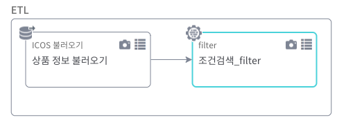

1. 기본 제공 기능

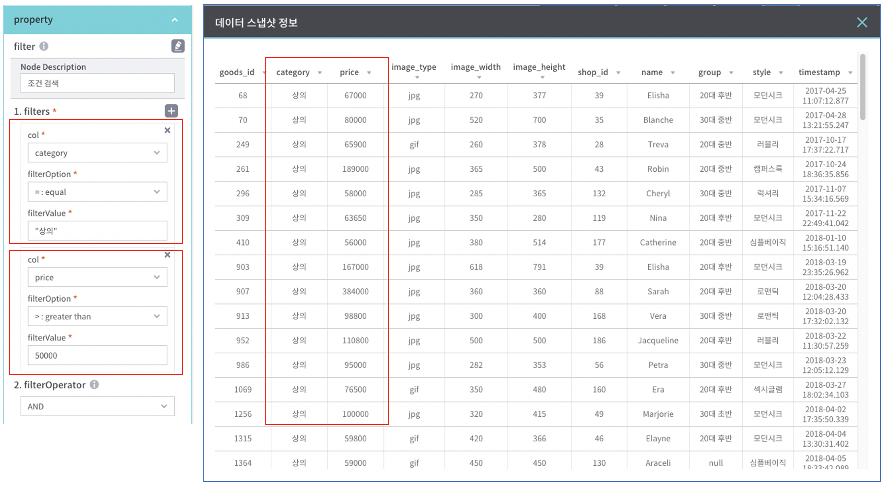

컬럼 n개에 대해서 필터 할 수 있음

| 항목 | 설명 |
|---|---|
| col | 목록 중 기준 컬럼 선택 |
| filterOption | less than(<), less than or equal(<=), equal(=), not equal(!=), greater than or equal(>=), greater than(>), contains, not contains, like |
| filterValue | 필터 기준값 입력 (문자열일 경우 ""으로 표현) |
| filterOperator | 필터 사이의 조건 연산자 (AND, OR) |

2. 사용자 입력 기능

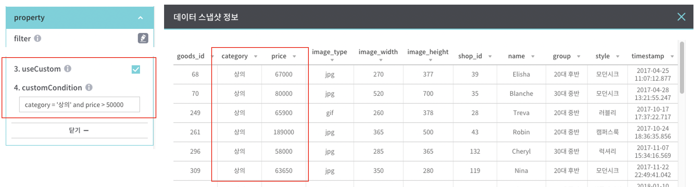

| 항목 | 설명 |
|---|---|
| useCustom | 사용자 입력 기능 사용 시 체크 |
| customCondition | 사용자가 원하는 조건식을 직접 입력 |

### sort

   - 데이터 정렬
   
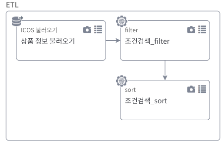

1. 기본 제공 기능

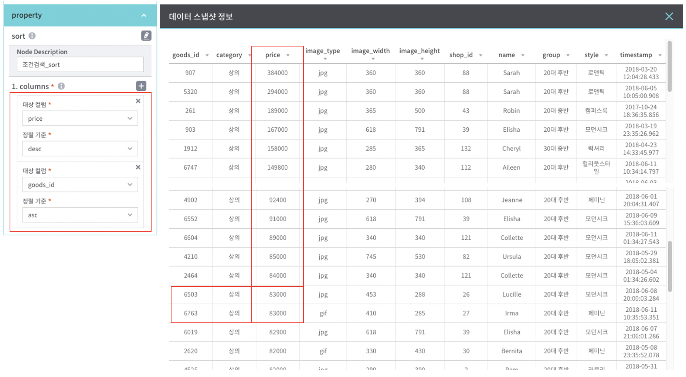

컬럼 n개에 대해서 정렬 할 수 있음

| 항목 | 설명 |
|---|---|
| 대상 컬럼 | 목록 중 기준 컬럼 선택 |
| 정렬 기준 | asc(오름차순), desc(내림차순) |

### select
   - 필요한 컬럼을 선택하여 데이터 조회
   
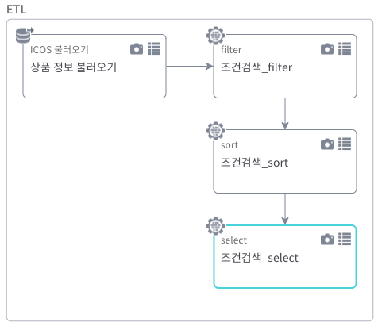

1. 기본 제공 기능

팝업 가능하며, 팝업에서는 순서를 볼 수 있음

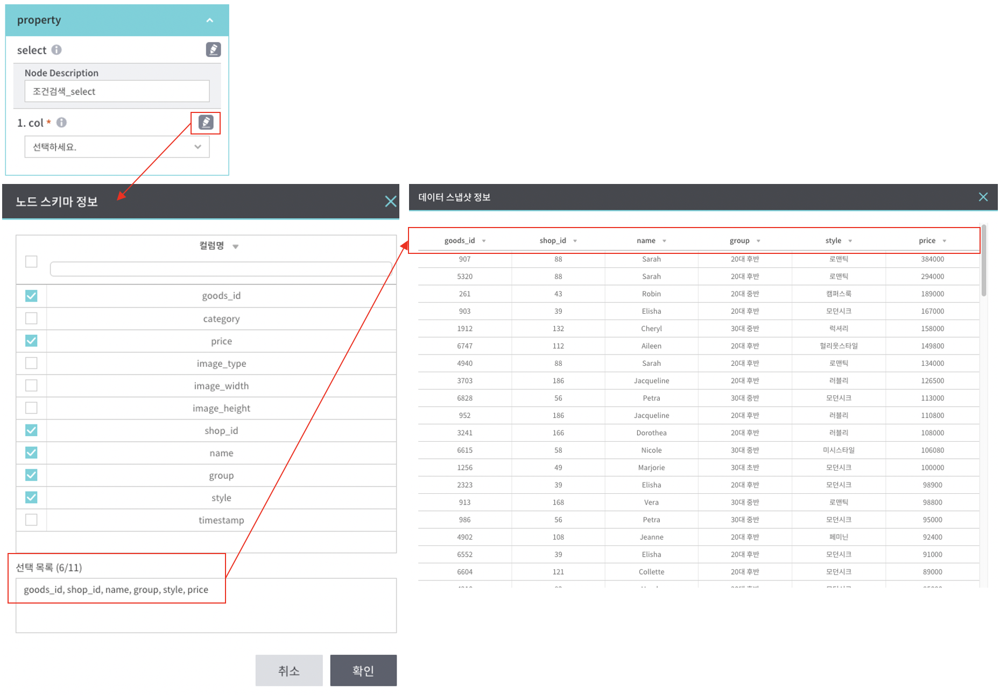

| 항목 | 설명 |
|---|---|
| col | 컬럼 목록 중 필요한 컬럼 선택 (선택 순서에 따라 노출) |

### limit
   - 데이터를 입력한 건수 만큼만 조회
   
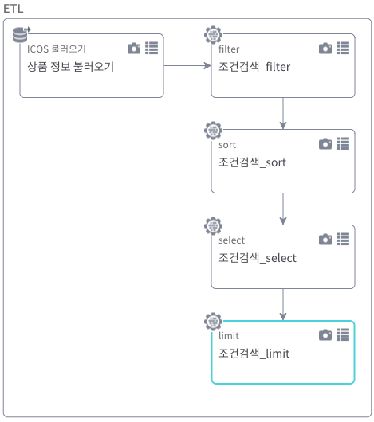

1. 기본 제공 기능

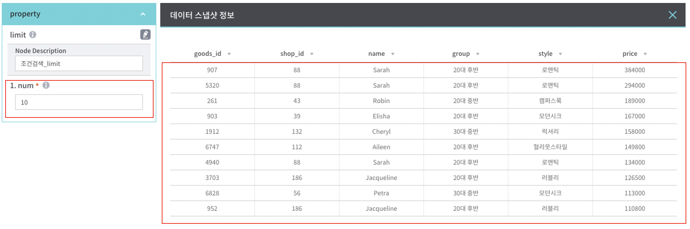

| 항목 | 설명 |
|---|---|
| num | 조회하고자 하는 데이터 건수 |  
   
### topN
   - 상위 몇 %의 데이터를 추출
   
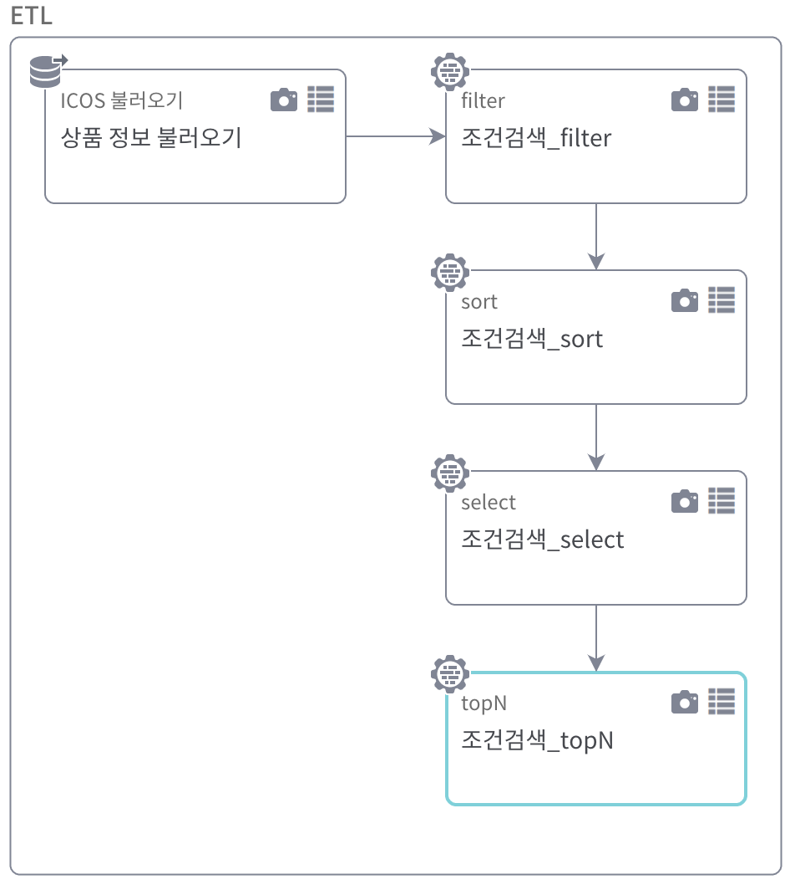

1. 기본 제공 기능

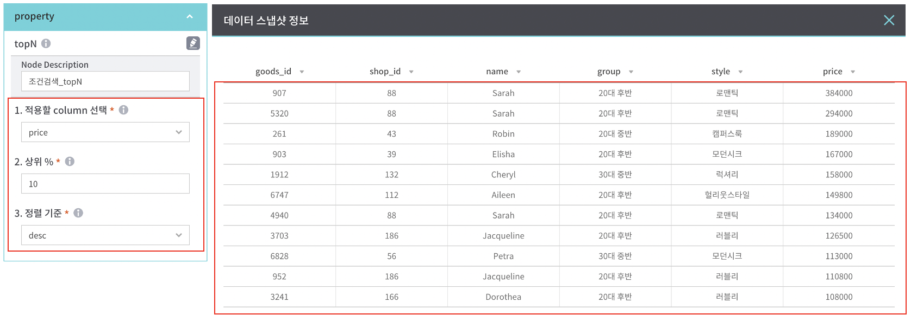

| 항목 | 설명 |
|---|---|
| 적용할 column 선택 | 기준 컬럼 선택 |  
| 상위 % | 추출하고자 하는 데이터 % 입력 (1-100 사이 ) |   
| 정렬 기준 | asc(오름차순), desc(내림차순) |    

